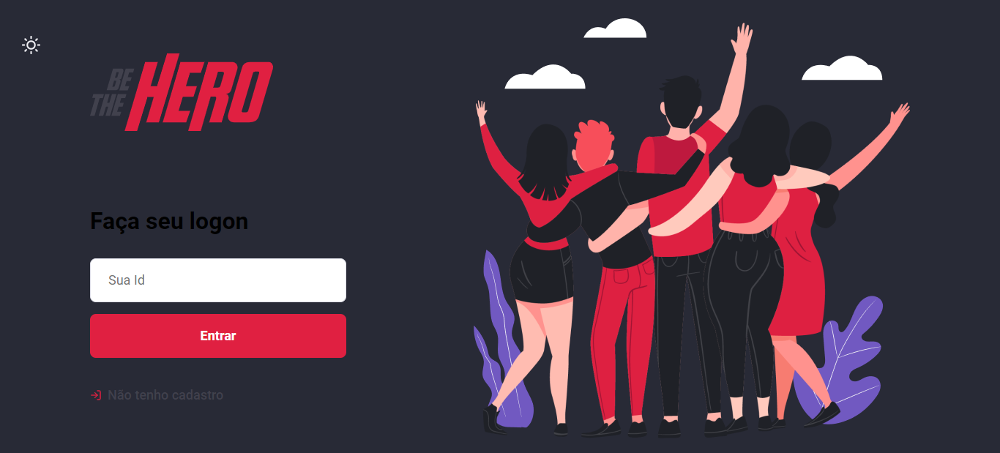

  

  <h1>Seja um verdadeiro Heroi</h1>

  

## Modificações

1. Quando o usuário estiver logado e acessar o logon, ele será redirecionado para profile novamente
2. Se a usuário não estiver logado e acessar a rota ‘profile’ ele será redirecionado para e tela inicial
3. Possibilidade de alterar casos (incidents)
4. Bug de id repetido consertado (antes tinha possibilidade de gerar dois ids iguais)
5. Bug de criar Casos e ONGS sem os dados consertado
6. Dracula Theme
7. Frontend responsivo

## Futuras Modificações

* [ ] Enviar Id para o email cadastrado
* [ ] Se não tiver nenhum caso, retornar um aviso de 'Nenhum caso cadastrado'

## Dracula Theme

<footer align="center">
  <h3>By João Azevedo</h3>
</footer>
